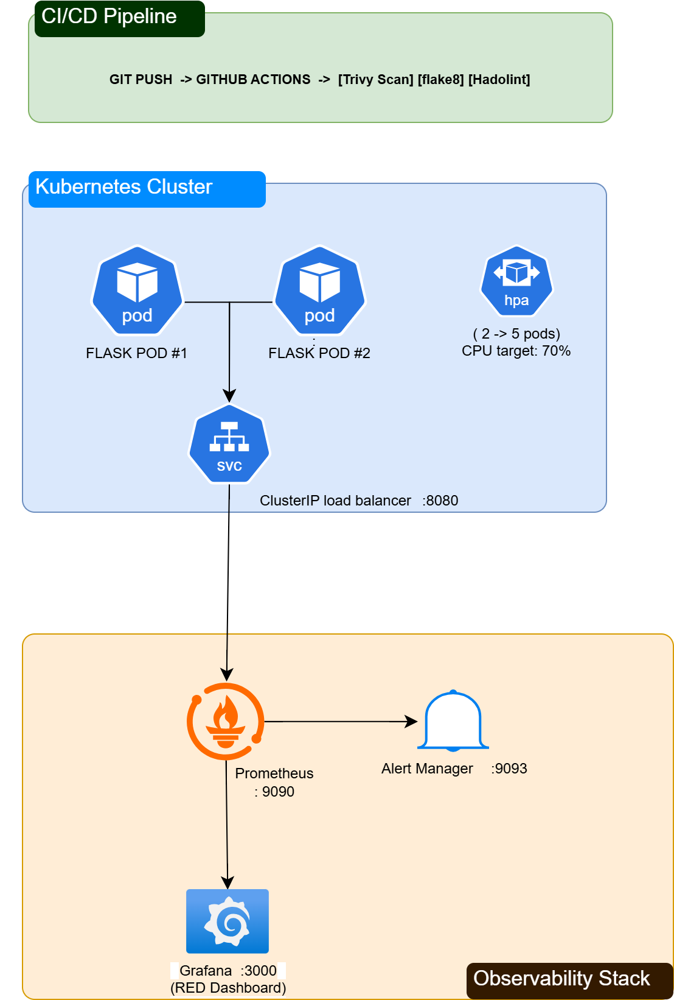

# DockerLens — Observable Containers with Prometheus & Grafana

A production-grade containerized Flask application with full observability: Prometheus metrics (RED method), Grafana dashboards, alerting, Trivy security scanning, Helm packaging, and Kubernetes deployment with self-healing and autoscaling.

## Architecture



## Project Status

| Step | Description | Status |
|------|-------------|--------|
| 1 | Flask app + Dockerfile + docker-compose | ✅ |
| 2 | Prometheus metrics instrumentation (RED) | ✅ |
| 3 | Prometheus + Grafana stack | ✅ |
| 4 | Grafana dashboards (request rate, latency, errors) | ✅ |
| 5 | Alert rules (HighErrorRate, HighLatency, AppDown) | ✅ |
| 6 | Trivy image scanning in CI | ✅ |
| 7 | Kubernetes manifests (Deployment, Service, HPA) | ✅ |
| 8 | Helm chart | ✅ |
| 9 | Chaos test (pod kill + self-healing) | ✅ |
| 10 | Documentation + ADRs | ✅ |

## Quick Start (Docker Compose)

```bash
# Clone and start the full observability stack
git clone https://github.com/jeianjaz/DockerLens.git
cd DockerLens
docker compose up --build -d

# Verify all services
docker compose ps
```

**Access the UIs:**
| Service | URL | Credentials |
|---------|-----|-------------|
| Flask App | http://localhost:8080 | — |
| Prometheus | http://localhost:9090 | — |
| Grafana | http://localhost:3000 | admin / admin |
| AlertManager | http://localhost:9093 | — |

## Quick Start (Kubernetes + Helm)

```bash
# Start minikube
minikube start --driver=docker
eval $(minikube docker-env)

# Build image locally
docker build -t dockerlens:latest .

# Deploy with Helm
helm install dockerlens ./helm/dockerlens --create-namespace

# Verify
kubectl get all -n dockerlens

# Access the app
kubectl port-forward svc/dockerlens-app 8080:8080 -n dockerlens
```

## Tech Stack

| Layer | Technology | Purpose |
|-------|------------|---------|
| Application | Flask (Python 3.12) + Gunicorn | REST API server |
| Container | Docker (multi-stage, non-root, healthcheck) | Secure packaging |
| Orchestration | Kubernetes (Minikube / EKS) | Container orchestration |
| Package Manager | Helm 3 | Templatized K8s deployments |
| Monitoring | Prometheus v3.4 | Metrics collection (pull-based) |
| Visualization | Grafana 11.6 | Dashboards + alerting UI |
| Alerting | Prometheus AlertManager v0.28 | Alert routing + notifications |
| Security | Trivy (CI) + Hadolint | Image CVE scanning + Dockerfile lint |
| CI/CD | GitHub Actions | Build → Scan → Lint pipeline |
| Linting | flake8 + Hadolint | Code quality gates |

## Observability — RED Metrics

This project implements the [RED method](https://grafana.com/blog/2018/08/02/the-red-method-how-to-instrument-your-services/) for microservice monitoring:

| Metric | PromQL | Alert Threshold |
|--------|--------|-----------------|
| **Rate** | `sum(rate(http_requests_total[1m])) by (endpoint)` | — |
| **Errors** | `rate(http_requests_total{status=~"5.."}[1m])` | > 10% for 1m |
| **Duration** | `histogram_quantile(0.95, rate(http_request_duration_seconds_bucket[5m]))` | > 2s for 2m |

## API Endpoints

| Endpoint | Method | Description |
|----------|--------|-------------|
| `/` | GET | Service info + version |
| `/health` | GET | Health check (K8s liveness/readiness probes) |
| `/metrics` | GET | Prometheus metrics endpoint |
| `/api/items` | GET | List container items |
| `/api/items` | POST | Create item |
| `/api/slow` | GET | Simulate latency (1-3s delay) |
| `/api/error` | GET | Simulate 500 errors |

## CI/CD Pipeline

```
git push → GitHub Actions
              ├── Trivy Image Scan (CRITICAL/HIGH CVEs)
              ├── Python Lint (flake8)
              └── Dockerfile Lint (Hadolint)
```

All 3 jobs run in parallel. Pipeline fails if:
- Trivy finds CRITICAL or HIGH vulnerabilities (with available fixes)
- flake8 finds code style violations
- Hadolint finds Dockerfile anti-patterns

## Chaos Engineering

Demonstrated Kubernetes self-healing:
1. Killed a running pod (`kubectl delete pod ...`)
2. Kubernetes Deployment controller detected desired state ≠ actual state
3. New pod spawned within seconds
4. Service continued routing to surviving pod — **zero downtime**

## Project Structure

```
.
├── app/
│   ├── main.py                  # Flask app with Prometheus instrumentation
│   └── requirements.txt         # Python dependencies
├── prometheus/
│   ├── prometheus.yml           # Scrape config + AlertManager connection
│   └── alert_rules.yml          # HighErrorRate, HighLatency, AppDown rules
├── alertmanager/
│   └── alertmanager.yml         # Alert routing configuration
├── grafana/
│   ├── dashboards/
│   │   └── dockerlens-red.json  # Auto-provisioned RED metrics dashboard
│   └── provisioning/
│       ├── dashboards/
│       │   └── dashboards.yml   # Dashboard provisioning config
│       └── datasources/
│           └── prometheus.yml   # Prometheus datasource auto-config
├── k8s/                         # Raw Kubernetes manifests
│   ├── namespace.yml
│   ├── deployment.yml
│   ├── service.yml
│   └── hpa.yml
├── helm/dockerlens/             # Helm chart (templatized)
│   ├── Chart.yaml
│   ├── values.yaml
│   └── templates/
│       ├── namespace.yml
│       ├── deployment.yml
│       ├── service.yml
│       └── hpa.yml
├── docs/
│   └── adr/                     # Architecture Decision Records
├── .github/workflows/
│   └── ci.yml                   # CI pipeline (Trivy + lint)
├── Dockerfile                   # Multi-stage, non-root, healthcheck
├── docker-compose.yml           # Full observability stack
└── .gitignore
```

## Architecture Decision Records

- [ADR-001: Prometheus over Datadog](docs/adr/001-prometheus-over-datadog.md)
- [ADR-002: Helm over Kustomize](docs/adr/002-helm-over-kustomize.md)

## Author

**Jeian Jasper** · [Portfolio](https://www.jeianjasper.me) · [GitHub](https://github.com/jeianjaz) · [LinkedIn](https://www.linkedin.com/in/jeianjasper/)
